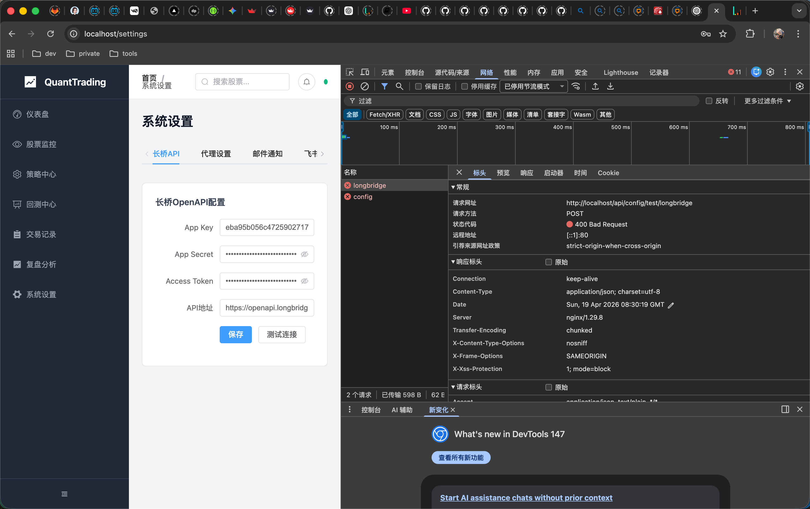
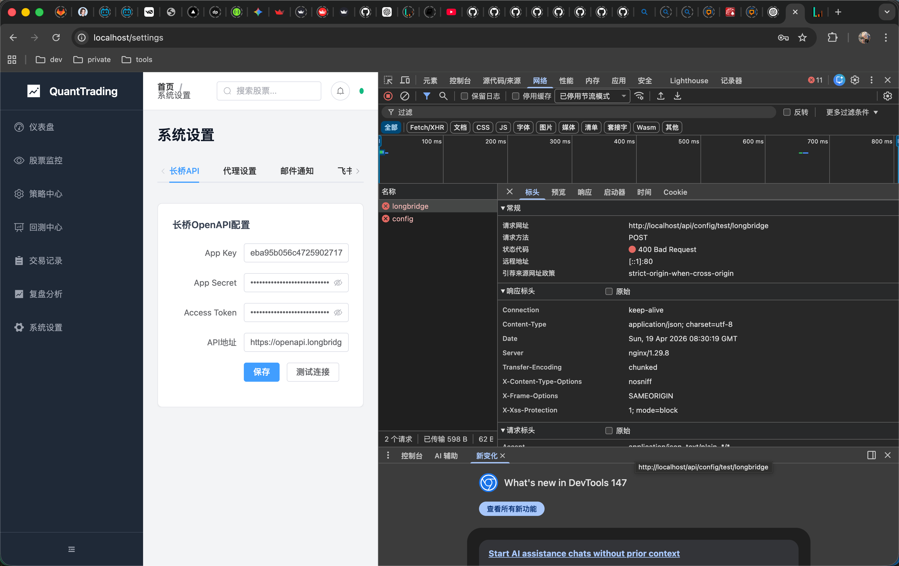

# QuantTrading - 美股量化交易系统

一个功能完整的美股量化交易系统，支持策略编辑、回测、实盘交易、监控告警等功能。

## 技术栈

- **后端**: ASP.NET Core 8 WebAPI
- **前端**: Vue 3 + TypeScript + Element Plus
- **数据库**: SQL Server 2022
- **部署**: Docker + Docker Compose

## 功能特性

### 核心功能
- **仪表盘**: 实时显示账户资产、今日盈亏、市场概况
- **股票监控**: 关注列表、实时行情、K线图表
- **策略中心**: 可视化策略编辑、条件配置、动作设置
- **策略热重载**: 修改策略后无需重启即可生效
- **回测中心**: 历史数据回测、收益分析、风险评估
- **交易记录**: 交易历史查询、统计分析
- **复盘分析**: 每日复盘记录、经验总结

### 数据源
- 集成长桥OpenAPI获取美股实时行情和历史数据
- 支持HTTP代理访问

### 通知服务
- 邮件通知 (SMTP)
- 飞书机器人通知
- 企业微信机器人通知

### 技术指标
支持以下技术指标作为策略条件：
- MA (移动平均线)
- EMA (指数移动平均线)
- MACD
- RSI (相对强弱指数)
- KDJ
- BOLL (布林带)

## 快速开始

### 环境要求
- Docker 20.10+
- Docker Compose 2.0+

### 部署步骤

1. 克隆项目
```bash
git clone <repository-url>
cd quant-trading
```

2. 配置环境变量
```bash
cp .env.example .env
# 编辑 .env 文件，填入您的配置
```

3. 启动服务
```bash
docker-compose up -d
```

4. 访问系统
- 前端界面: http://localhost
- 后端API: http://localhost:5000

### 配置说明

#### 长桥API配置
1. 注册长桥开放平台账号: https://open.longbridge.com
2. 创建应用获取 App Key 和 App Secret
3. 获取 Access Token
4. 在系统设置中配置或通过环境变量设置

#### 代理配置
如果需要通过代理访问长桥API：
```env
PROXY_ENABLED=true
PROXY_HOST=127.0.0.1
PROXY_PORT=7890
```

#### 通知配置

**邮件通知**
```env
EMAIL_ENABLED=true
EMAIL_SMTP_HOST=smtp.gmail.com
EMAIL_SMTP_PORT=587
EMAIL_USERNAME=your_email@gmail.com
EMAIL_PASSWORD=your_app_password
```

**飞书通知**
```env
FEISHU_ENABLED=true
FEISHU_WEBHOOK_URL=https://open.feishu.cn/open-apis/bot/v2/hook/xxx
```

**企业微信通知**
```env
WECHAT_ENABLED=true
WECHAT_WEBHOOK_URL=https://qyapi.weixin.qq.com/cgi-bin/webhook/send?key=xxx
```

## 项目结构

```
quant-trading/
├── backend/
│   └── QuantTrading.Api/
│       ├── Controllers/     # API控制器
│       ├── Models/          # 数据模型
│       ├── Services/        # 业务服务
│       │   ├── LongBridge/  # 长桥API集成
│       │   ├── Strategy/    # 策略引擎
│       │   ├── Backtest/    # 回测服务
│       │   ├── Monitor/     # 监控服务
│       │   └── Notification/# 通知服务
│       ├── Jobs/            # 定时任务
│       ├── Hubs/            # SignalR Hub
│       └── Data/            # 数据库上下文
├── frontend/
│   └── src/
│       ├── api/             # API接口
│       ├── views/           # 页面组件
│       ├── layouts/         # 布局组件
│       ├── stores/          # Pinia状态管理
│       ├── router/          # 路由配置
│       ├── types/           # TypeScript类型
│       └── styles/          # 样式文件
├── docker-compose.yml
└── .env.example
```

## 开发指南

### 本地开发

**后端**
```bash
cd backend/QuantTrading.Api
dotnet restore
dotnet run
```

**前端**
```bash
cd frontend
pnpm install
pnpm dev
```

### 策略配置示例

```json
{
  "conditions": [
    {
      "type": "price_above",
      "params": { "value": 150 },
      "operator": "and"
    },
    {
      "type": "rsi_below",
      "params": { "period": 14, "value": 30 },
      "operator": "and"
    }
  ],
  "actions": [
    {
      "type": "buy",
      "params": { "quantity": 100, "priceType": "market" }
    },
    {
      "type": "notify_feishu",
      "params": { "message": "策略触发买入信号" }
    }
  ],
  "targetSymbols": ["AAPL", "MSFT", "GOOGL"],
  "checkInterval": 300
}
```

## 注意事项

1. 本系统仅供学习和研究使用，不构成投资建议
2. 实盘交易存在风险，请谨慎操作
3. 请确保遵守相关法律法规和交易所规则
4. 长桥API有调用频率限制，请合理设置检查间隔

## Streamlit Cloud 部署

本仓库已提供 `streamlit_app.py`，可直接部署到 [share.streamlit.io](https://share.streamlit.io/)。

1. 在 Streamlit Cloud 选择该 GitHub 仓库
2. Main file path 填写 `streamlit_app.py`
3. 在 Secrets 配置：
   - `BACKEND_API_URL`：已部署的后端地址（例如 `https://your-backend.example.com`）
   - `FRONTEND_URL`：可选，前端地址
4. 部署后即可查看关注列表、行情和交易记录

## 线上前端自动跟随本地后端

如果你当前是“线上前端 + 本地后端（15000）”模式，可使用脚本自动保持可用：

```bash
chmod +x scripts/keep_frontend_online.sh
./scripts/keep_frontend_online.sh
```

脚本会自动执行：

1. 检查本地后端健康（`http://localhost:15000/health`）
2. 创建 `trycloudflare` 公网隧道
3. 更新 Vercel `BACKEND_API_BASE_URL` 与 `VITE_SIGNALR_BASE_URL`
4. 自动触发前端生产部署
5. 持续巡检，隧道失效后自动重建并重新同步

注意：

1. 脚本会把 `BACKEND_API_BASE_URL`/`VITE_SIGNALR_BASE_URL` 以 `no-sensitive` 方式写入 Vercel（因为这是公网隧道地址，本身可公开），这样可以避免“变量存在但线上函数读取为空”的问题。
2. 这是“本地后端在线即线上可用”的方案。若需要彻底独立（本机离线仍可用），需把后端部署到常驻云主机。

## 后端公网部署

后端已提供公网容器部署配置：

- `Dockerfile.backend`：面向 Railway / Render / Fly 等容器平台的后端镜像，支持平台注入的 `PORT`。
- `railway.toml`：Railway 配置即代码，启用 `/health` 健康检查和失败重启。
- `render.yaml`：Render Blueprint，包含 Web Service + Postgres。

推荐环境变量：

```env
ASPNETCORE_ENVIRONMENT=Production
Database__Provider=postgres
DATABASE_URL=<托管 Postgres 连接串>
LongBridge__BaseUrl=https://openapi.longbridge.com
LongBridge__AppKey=<你的 App Key>
LongBridge__AppSecret=<你的 App Secret>
LongBridge__AccessToken=<你的 Access Token>
OpenAI__Enabled=true
OpenAI__ApiKey=<你的模型 API Key>
OpenAI__BaseUrl=<模型 OpenAI 兼容地址>
OpenAI__Model=<默认模型名称>
```

部署完成后，把 Vercel 前端的 `BACKEND_API_BASE_URL` 和 `VITE_SIGNALR_BASE_URL` 更新为公网后端域名，然后重新部署前端：

```bash
cd frontend
vercel env rm BACKEND_API_BASE_URL production --yes
vercel env add BACKEND_API_BASE_URL production --value "https://your-api.example.com" --no-sensitive --yes
vercel env rm VITE_SIGNALR_BASE_URL production --yes
vercel env add VITE_SIGNALR_BASE_URL production --value "https://your-api.example.com" --no-sensitive --yes
vercel --prod --yes
```

## 免费数据库方案

后端已支持 SQL Server 和 Postgres 双驱动。

- 使用 SQL Server（默认）
  - `DB_PROVIDER=sqlserver`
- 使用免费 Postgres（推荐 Neon/Supabase）
  - `DB_PROVIDER=postgres`
  - `DB_CONNECTION=Host=...;Port=5432;Database=...;Username=...;Password=...;SSL Mode=Require;Trust Server Certificate=true`

在 Docker 场景下，`docker-compose.yml` 已支持通过 `DB_PROVIDER` / `DB_CONNECTION` 覆盖数据库连接。

## License

MIT
